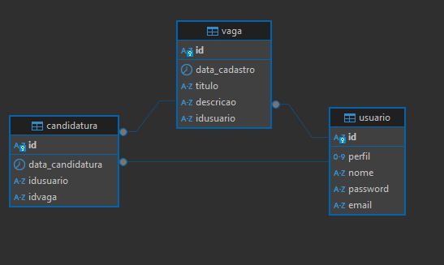

> # Desafio FullStack Pacto Soluções
>
> Neste documento estará descrito o que foi feito do desafio Fullstack proposto pela Pacto Soluções

> ### ATENÇÃO: Para o funcionamento do tutorial que será descrito abaixo é necessário ter alguns pré-requisitos devidamente instalados e configurados no computador em que deseja executar.
>
> - Ambiente Docker devidamente instalado e configurado para utilizar Docker Compose
> - Git instalado e funcionando normalmente
> - Portas 5432, 8080 e 80 sem utilização, pois estas serão responsáveis por se conectarem com o Banco de Dados, API e Frontend respectivamente
> - Navegador Web atualizado
>
> Feito os esclarecimentos vamos para o projeto.

> ##### 1. Projeto Proposto
>
> O desafio proposto pela Pacto Soluções tinha por objetivo:
>
> Desenvolver uma aplicação web que facilite o processo de recrutamento interno para os colaboradores da empresa. A aplicação
> deve permitir aos usuários pesquisar e candidatar-se a vagas internas.
>
> RF-1: Autenticação e Autorização:
> ○ Implementar um sistema de autenticação básico para os
> usuários.
>
> RF-2: Cadastro de Vagas:
> ○ Permitir que os administradores cadastrem novas vagas,
> incluindo título e descrição.
> RF-3: Candidatura a Vagas:
> ○ Implementar um sistema simples de candidatura às vagas.

> ##### 2. Análise do Projeto e estruturação
>
> Após a análise dos requisitos foi definido que:
>
> - Seria criado uma API RESTful utilizando Spring Framework, Boot, Security e Web.
>
> - Seria utilizado a imagem oficial do banco Postgresql mais recente disponibilizado no Docker Hub
>
> - Seria criado o frontend com Angular v16
>
> - No projeto backend haverá 2 controllers principais, um responsável pelo cadastro de usuários e autenticação e outro para os processos pertinentes ao cadastro e listagem de vagas e candidatura nas mesma.
>
> - No frontend haveriam as seguintes telas:
>
>   - Home (Login)
>   - Registro
>   - Vagas (Listagem)
>   - Cadastro de Vagas
>   - Candidaturas
>   - Erro de Unauthorized
>
> - Imagem (Esquema de Banco de Dados Criado):
>
>   

> ##### 3.Passo a Passo para iniciar o projeto 
>
> ###### Obs: É necessário ter o Docker instalado e funcionando com Docker compose. Além disso as portas 5432,8080 e 80 devem estar disponíveis para uso da aplicação. 
>
> 1. Crie uma pasta para salvar os arquivos do projeto
>    1. Abra o git bash e navegue até a pasta criada utilizando o comando cd caminho-até-a-pasta
>    2. Na pasta execute o comando git init
>    3. Execute o comando git remote add origin https://github.com/Hibrael01/desafio-pacto-full-stack.git
>    4. git pull origin master
>    5. Aguarde até que todos os arquivos tenham sido baixados
>    6. Verifique a pasta criada, se todos os arquivos se encontram
>    7. Verifique se o arquivo docker-compose.yml se encontra na pasta
>    8. Abra um terminal e navegue até a pasta com o comando cd caminho-até-a-pasta. Ou se preferir pelo explorador de arquivos, vá até a pasta e clique em uma área vazia com o botão direito e clique em "Abrir no Terminal"
>    9. Uma vez no terminal digite docker-compose up
>    10. Aguarde algum tempo, caso tenha o Docker Desktop instalado verifique se os 3 contêineres executando o Banco de Dados, Api e frontend estão executando. 
>    11. Caso não tenha o Docker Desktop, em um novo terminal execute o comando docker ps. Deverá receber o seguinte retorno:
>        
>        
>    12. Se tiver o resultado acima, basta abrir um navegador e digitar http://localhost/ e você será redirecionado para a tela inicial da aplicação
>    13. Observações finais. Toda a API está devidamente finalizada, porém, as telas de listagem de vagas, cadastro de vagas e candidaturas não foram finalizadas. Para visualizar e testar a API, basta realizar o download do software [Insomnia](https://insomnia.rest/download)  e então importar o arquivo API Vagas Pacto.json para o mesmo.
>
> ###### Obrigado para aqueles que leram até aqui e tentaram executar o projeto para verificação do mesmo, foi um desafio muito interessante de se participar, colocando em prática diversos conhecimentos para o desenvolvimento completo de uma aplicação.
>
> Para quaisquer dúvidas ou problemas em relação ao projeto ou documentação contate-me via e-mail: hibrael46@gmail.com
